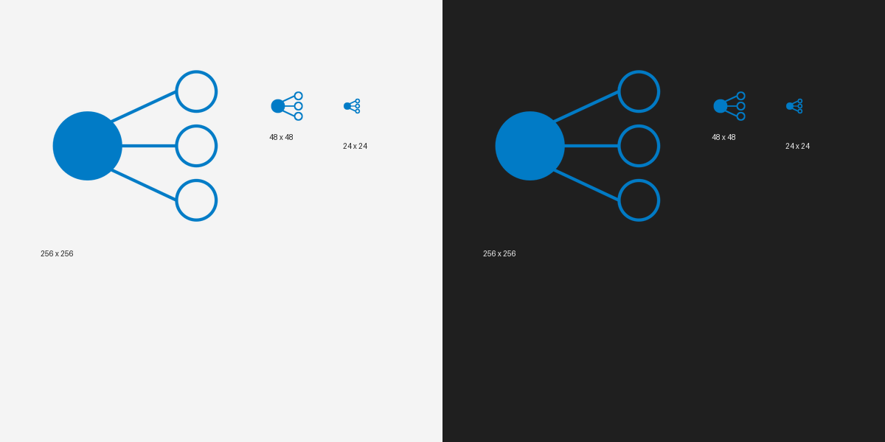
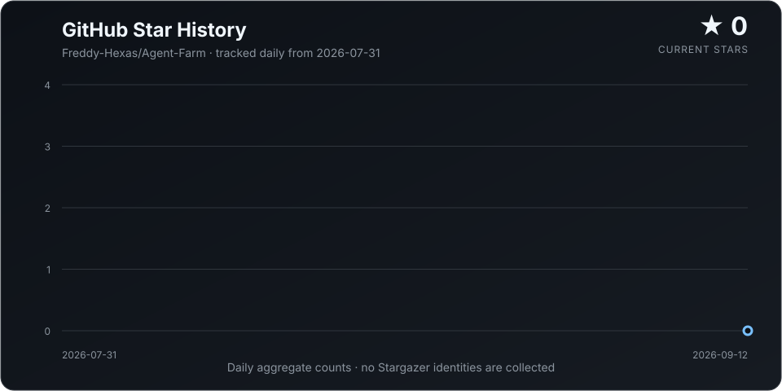

<div align="center">
  
  <h1>Agent Farm</h1>
  <p><strong>Use your best model for judgment. Use economical models for the work.</strong></p>
  <p>A native Windows workspace for planning, running, and reviewing multi-agent jobs across models and providers.</p>

  [](releases/v0.5.0.13)
  [](releases/v0.5.0.13)
  [](https://github.com/Freddy-Hexas/Agent-Farm/actions/workflows/ci.yml)
  [](https://github.com/Freddy-Hexas/Agent-Farm/actions/workflows/security.yml)
  [](LICENSE)
</div>

---

## The practical problem

Suppose you ask an agent to investigate a large repository, compare several implementation options,
edit six files, run tests, and explain the result.

Using one premium model for the entire job works, but it spends premium tokens on everything:
listing files, searching symbols, reading repetitive code, running commands, and drafting intermediate
notes. Giving the whole job to a cheap model saves money, but increases the chance of a weak plan,
missed constraints, or an unconvincing final answer.

Agent Farm separates those responsibilities:

- A high-capability **Supervisor** understands the goal, splits the work, assigns models, checks
  evidence, and owns the final decision.
- Economical **Workers** research, inspect, edit, test, and produce bounded artifacts in parallel.
- Deterministic gates verify paths, diffs, tests, budgets, and permissions before results are accepted.

```text
Your request
    |
    v
Premium Supervisor  -- plan, route, judge, synthesize
    |
    +---- Economy Worker A  -- inspect or research
    +---- Economy Worker B  -- implement or analyze
    +---- Local Worker C    -- test or review
              |
              v
       isolated worktrees
       streaming activity
       patches + tests + evidence
              |
              v
Premium Supervisor  -- final report, decision, or reviewed change set
```

The expensive model spends its time where capability matters. The cheaper models do the scalable
work.

## What this looks like in real work

### Research without one agent wandering the web

> Investigate the latest memory-chip news. Have one Worker collect supply and pricing developments,
> another analyze listed companies, and a third audit sources. Produce one cited report.

The Supervisor creates a finite plan. Research Workers browse within explicit tool budgets, stream
their findings, and save artifacts. The Supervisor then compares the evidence and writes one coherent
deliverable instead of pasting three unrelated answers together.

### Repository changes without agents colliding

> Upgrade the authentication module. Keep CI untouched. Let one Worker map the current behavior,
> one implement the change, and one focus on regression tests.

Each Worker receives its own Git worktree and path allowlist. Agent Farm collects the changed files,
patch, command logs, and test results before the Supervisor reviews anything. Workers never silently
edit the main workspace together.

### Mix providers instead of committing to one model stack

Use a premium hosted model for the Supervisor, an economical hosted model for routine Workers, and a
local Ollama or LM Studio model for private or repetitive tasks. Every route is explicit. A Worker does
not silently inherit the Supervisor's provider or model.

## Why Agent Farm is different

| Everyday problem | Agent Farm's answer |
| --- | --- |
| Premium models are used for low-value mechanical steps | Separate Supervisor and Worker routes |
| Cheap models struggle with open-ended planning | Keep intent, decomposition, and final review with the Supervisor |
| Parallel agents overwrite one another | Give every Worker an isolated Git worktree |
| A black box says “done” with no proof | Stream model output, tools, files, tests, usage, and failures |
| Provider settings do not match the selected model | Load provider model catalogs and model-aware reasoning controls |
| Long jobs disappear when the window closes | Persist jobs and events in a long-lived local daemon |
| Agent changes are difficult to trust | Enforce allowed paths, approvals, machine review, checkpoints, and rollback |

Agent Farm includes its own native agent runtime. It does not require Codex to run a farm; a legacy
Codex compatibility backend remains optional.

## Product experience

Agent Farm is a real native Windows application built with WinUI 3 and XAML. The desktop does not
embed its interface in a WebView.

- Native project navigation, persistent threads, task composer, Settings, Runs, and review surfaces.
- Resizable navigation and execution panes with taskbar-safe maximized startup.
- File attachments and repository-local artifact handling.
- Incremental Supervisor and Worker output instead of waiting for one final response.
- Live Worker status, tool activity, approvals, token usage, errors, and cancellation.
- Durable jobs and reconnectable event history when the app or daemon restarts.
- Provider and model selection directly inside Supervisor and Worker settings.
- Reviewable patches, changed files, tests, deliverables, diagnostics, and rollback checkpoints.

## Supported model routes

Agent Farm ships provider templates, credential fields, endpoints, catalog discovery, and compatible
reasoning controls for:

| Category | Providers and runtimes |
| --- | --- |
| Direct providers | OpenAI, Anthropic, Google Gemini, xAI, Mistral AI |
| China-region providers | DeepSeek, Kimi, Alibaba Cloud Qwen, Zhipu GLM, Volcengine Ark / Doubao |
| Model gateways | OpenRouter, SiliconFlow, GroqCloud, Together AI, Fireworks AI |
| Local runtimes | Ollama, LM Studio |
| Custom endpoints | OpenAI-compatible Responses or Chat Completions APIs |

Official templates load the models available to the configured account and present them as a list.
The **Custom OpenAI-compatible** template is a universal gateway route: it requests `GET /models`,
keeps every compatible text-generation model the gateway returns (including namespaced IDs such as
`anthropic/claude-sonnet-4.5` and `deepseek/deepseek-v4`), and keeps an exact Model ID field for
gateways that do not expose a catalog. A gateway named or configured by the user is treated the same
way, even when it does not have an official Agent Farm template.

The route editor also exposes neutral **Thinking** and **Reasoning effort** controls for gateway
models. Agent Farm maps these controls to the selected family where the gateway convention is known
(for example `enable_thinking` for Qwen and `thinking.type` for Claude/DeepSeek/Kimi-style routes),
while retaining the original model ID and allowing aliases that are not recognized in advance.

## Install the current Windows preview

> [!IMPORTANT]
> Version 0.5.0.13 is a development-signed preview. The application itself is self-contained, but the
> first installation requires trusting the included development certificate. A public one-click,
> CA-signed installer channel is still being prepared.

### Requirements

- Windows 10 version 1809 or newer; Windows 11 is recommended.
- An x64 processor.
- Git available on `PATH`.
- At least one provider API key, unless every selected route is local.
- Docker Desktop and a suitable language image when securely executing repository code or tests in
  the default `workspace-write` sandbox. Agent Farm fails closed if that sandbox is unavailable.

The packaged Release build includes the .NET, Windows App SDK, and frozen Python runtime. Users do not
need to install Python separately.

### Run the source build with one click

For local development, double-click [`Start-AgentFarm.cmd`](Start-AgentFarm.cmd) in the repository root.
It opens the native WinUI Debug build in this checkout, starts the Python source daemon automatically,
and keeps the repository selected as the initial workspace. The launcher checks Python and the .NET SDK
before starting; no terminal command is required. Use `Start-AgentFarm.cmd --check` when you want a
quick prerequisite check without opening the app. If Windows rejects the local WinUI AppX before the
application can start, the launcher keeps the failure visible in the terminal so the native runtime can
be diagnosed instead of silently switching to a different desktop implementation.

### Download and install

Download these files from [`releases/v0.5.0.13`](releases/v0.5.0.13):

- [`AgentFarm-Native-x64.msix`](https://github.com/Freddy-Hexas/Agent-Farm/raw/main/releases/v0.5.0.13/AgentFarm-Native-x64.msix)
- [`AgentFarm-dev.cer`](https://github.com/Freddy-Hexas/Agent-Farm/raw/main/releases/v0.5.0.13/AgentFarm-dev.cer)
- [`SHA256SUMS.txt`](https://github.com/Freddy-Hexas/Agent-Farm/raw/main/releases/v0.5.0.13/SHA256SUMS.txt)

Import the certificate for the current user:

```powershell
Import-Certificate `
  -FilePath .\AgentFarm-dev.cer `
  -CertStoreLocation Cert:\CurrentUser\TrustedPeople
```

Then double-click `AgentFarm-Native-x64.msix`, select **Install**, and launch **Agent Farm** from the
Start menu. The preview package is signed with publisher `CN=Agent Farm`; inspect the certificate and
checksum before trusting it.

## Your first farm in five minutes

1. Open Agent Farm and choose the Git repository you want to work with.
2. Open **Settings > Providers** and add a provider template, endpoint, and API key.
3. Open **Settings > Agents** and select a high-capability Supervisor provider and model.
4. Create at least one Worker profile with an economical or local model.
5. Return to the workspace and describe the outcome, constraints, and desired deliverable.
6. Review the proposed Worker plan, then watch each model's output and tool activity stream live.
7. Inspect the final files, tests, evidence, and Supervisor result before applying changes.

A useful first prompt is concrete about roles and boundaries:

```text
Review this repository's startup path.

Use two Workers:
1. Map initialization, configuration, and failure handling without editing files.
2. Identify the three highest-impact reliability improvements and add focused tests.

Do not modify CI or release packaging. Summarize findings and changed files in one report.
```

## How a farm runs

1. **Plan** - the Supervisor turns the request into a validated Worker Plan.
2. **Route** - each Worker resolves to a named provider, model, capability tier, budget, and reasoning
   mode.
3. **Isolate** - Agent Farm creates one worktree per Worker from the same base commit.
4. **Execute** - Workers inspect, research, edit, or test within their declared tools and paths.
5. **Stream** - model deltas, tool calls, approvals, usage, and failures appear as ordered events.
6. **Collect** - each Worker returns files, a patch, test logs, and structured evidence.
7. **Review** - machine rules reject unsafe or out-of-scope results.
8. **Synthesize** - the Supervisor compares passing evidence and produces the final deliverable or
   change decision.

### Durable sessions and child agents

Every Farm, Supervisor, Worker, thread, and synthesis run has a durable session identity. The daemon
stores an append-only event ledger in `.agent-farm/runtime/runtime.sqlite3`; the desktop can replay
from an event cursor after a restart instead of reconstructing state from browser memory. The
compatibility job and thread endpoints remain available as projections of that ledger.

The loopback API exposes the same lifecycle for integrations and future harnesses:

```text
GET  /api/sessions
GET  /api/sessions/{id}
GET  /api/sessions/{id}/events?after=42
POST /api/sessions/{id}/spawn
POST /api/sessions/{id}/cancel
POST /api/sessions/{id}/interrupt
POST /api/sessions/{id}/resume
GET  /api/sessions/{id}/report
```

Child sessions carry `parent_session_id`, `harness_id`, `provider_id`, `model_id`, `route_id`, and a
bounded permission policy. Reports expose final evidence and lifecycle counters, not the complete
Supervisor transcript. Credential-like environment variables are removed from child environments by
default; a provider key must be explicitly allowlisted for a child run.

Inference requests are not cut off by a short HTTP client timeout. Long-thinking models can continue
until the task is cancelled or reaches its configured execution boundary.

## Safety model

Agent Farm is designed for observable, bounded execution rather than unrestricted autonomy.

- **Secrets stay local.** API keys live in `.agent-farm/secrets.env` or the process environment and
  are never returned by the Settings API.
- **Writes are scoped.** `allowed_paths` and `forbidden_paths` are checked during execution and again
  during review.
- **Workers are isolated.** Candidate changes happen in per-Worker worktrees, not the main workspace.
- **Commands avoid a shell.** The command runner accepts bounded executable and argument structures.
- **Risky actions can pause.** File, command, and network operations support durable approvals.
- **Repository code is contained.** Secure test execution uses a network-denied Docker sandbox with
  resource limits and no silent host fallback.
- **Changes remain reversible.** Apply and merge operations use checkpoints and rollback records.

These controls reduce risk; they do not turn model-generated work into trusted human-reviewed code.
See the full [security model](docs/SECURITY.md).

## Architecture at a glance

```text
Native WinUI 3 desktop
    |  threads, composer, settings, streaming execution, review
    v
Loopback daemon API (HTTP + SSE)
    |  durable SQLite jobs, events, approvals, usage, diagnostics
    +-- Supervisor planner and final reviewer
    +-- cost- and capability-aware farm scheduler
    v
Native agent runtime
    |  Responses + Chat Completions adapters
    |  repository, command, attachment, and research tools
    +-- Worker A -> isolated worktree -> patch + evidence
    +-- Worker B -> isolated worktree -> patch + evidence
    +-- Worker N -> isolated worktree -> patch + evidence
```

The daemon can outlive the desktop window, preserve in-flight state, and replay missed events when the
client reconnects. Debug builds call the Python source runtime; Release builds call the frozen
`AgentFarmBackend.exe` bundled with the application.

For details, see [Architecture](docs/ARCHITECTURE.md), [Harness contract](docs/HARNESSES.md),
[Core runtime notes](docs/CORE_RUNTIME.md), [Protocol](docs/PROTOCOL.md), and
[Desktop application](docs/DESKTOP_APP.md).

## Local configuration and credentials

The native Settings UI is the recommended configuration path. For automation, the same routes can be
stored in the ignored `agent-farm.local.json` file:

```json
{
  "agent_backend": "native",
  "supervisor_provider": "premium-openai",
  "supervisor_model": "your-high-capability-model",
  "default_worker_profile": "economy",
  "max_parallel_workers": 2,
  "secrets_env": ".agent-farm/secrets.env",
  "model_providers": {
    "premium-openai": {
      "template_id": "openai",
      "name": "OpenAI Supervisor",
      "base_url": "https://api.openai.com/v1",
      "env_key": "OPENAI_API_KEY",
      "wire_api": "responses"
    },
    "economy-deepseek": {
      "template_id": "deepseek",
      "name": "DeepSeek Workers",
      "base_url": "https://api.deepseek.com",
      "env_key": "DEEPSEEK_API_KEY",
      "wire_api": "chat"
    }
  },
  "worker_profiles": {
    "economy": {
      "display_name": "Economy Worker",
      "provider": "economy-deepseek",
      "model": "your-economical-model",
      "timeout_seconds": 900
    }
  }
}
```

Store credentials separately:

```dotenv
OPENAI_API_KEY=replace-with-your-key
DEEPSEEK_API_KEY=replace-with-your-key
```

Never commit `agent-farm.local.json`, `.agent-farm/secrets.env`, `.env`, diagnostic bundles, or real
API keys.

## CLI and automation

The desktop app is the primary interface. The Python CLI remains available for automation,
integration tests, and diagnostics:

```powershell
# Install from source
python -m pip install -e ".[test]"

# Create public and local configuration templates
agent-farm init
agent-farm init-local

# Run a validated multi-Worker plan
agent-farm farm-run `
  --repo . `
  --plan .\worker-plan.json `
  --config .\agent-farm.local.json

# Inspect the aggregate review package
agent-farm farm-review --farm .\.agent-farm\farms\<farm-id>
```

Run `agent-farm --help` for single-Worker run, review, merge, cleanup, farm decision, and automation
commands. `agent-farm desktop` launches the native WinUI source build; `agent-farm ui` is only a
developer-facing legacy browser console and is not the Agent Farm product UI.

## Develop Agent Farm

### Prerequisites

- Python 3.11 or newer.
- .NET 8 SDK or newer.
- Windows App SDK / WinUI 3 build dependencies.
- Microsoft WinApp CLI for packaged Debug launch and native UI automation.
- Git.

Install development dependencies:

```powershell
python -m pip install -e ".[test,build]"
```

Run the Python suite and native state tests:

```powershell
python -X utf8 -m pytest -q tests
dotnet run --project .\AgentFarm.Desktop.StateTests\AgentFarm.Desktop.StateTests.csproj
```

Build native WinUI with warnings treated as errors:

```powershell
dotnet build .\AgentFarm.Desktop\AgentFarm.Desktop.csproj `
  --configuration Debug `
  -p:Platform=x64 `
  -warnaserror
```

Use `winapp run` or the repository's WinUI workflow to launch the packaged Debug output. Do not run
the generated WinUI executable directly because the application requires package identity.

Release packaging freezes the Python backend, builds a self-contained WinUI app, signs and timestamps
the MSIX, verifies the frozen runtime, creates AppInstaller metadata, and writes SHA256 checksums. See
[Releasing Agent Farm](docs/RELEASING.md).

## Repository map

```text
AgentFarm.Desktop/       Native WinUI 3 and XAML application
AgentFarm.Core/          Platform-neutral desktop state and contracts
agent_farm/              Supervisor, Workers, tools, routing, storage, and API
examples/                Safe configuration and Worker Plan examples
packaging/               Frozen backend and Windows release definitions
scripts/                 Build, packaging, verification, and UI automation
tests/                   Unit, integration, security, protocol, and UI tests
docs/                    Public architecture, protocol, security, and release docs
```

Useful references:

- [Architecture](docs/ARCHITECTURE.md)
- [Desktop application](docs/DESKTOP_APP.md)
- [Protocol](docs/PROTOCOL.md)
- [Security](docs/SECURITY.md)
- [Pricing and usage](docs/PRICING_AND_USAGE.md)
- [Current limitations](docs/LIMITATIONS.md)
- [Release process](docs/RELEASING.md)

## Current preview limitations

- The checked-in installer is development-signed and requires manual certificate trust.
- The current package targets Windows x64 only.
- Public Stable and Preview update channels still require production-signed GitHub Release assets.
- Secure repository-code execution depends on Docker Desktop and the relevant language image.
- Provider behavior can vary when a vendor implements only part of a compatible API.
- Public research cannot bypass authentication, paywalls, anti-bot controls, or inaccessible sources.
- Model output still requires human judgment for production, financial, medical, legal, or other
  high-impact decisions.

The complete and versioned list is maintained in [Current limitations](docs/LIMITATIONS.md).

## Contributing

Issues and focused pull requests are welcome.

1. Keep credentials, local routes, internal progress ledgers, and build artifacts out of Git.
2. Add or update tests for behavior changes.
3. Run the complete Python suite.
4. Build the native x64 project for desktop changes.
5. Document new configuration fields, provider behavior, and user-visible limitations.

## License

Agent Farm is released under the [MIT License](LICENSE).

## Star history

<p align="center">
  <a href="https://github.com/Freddy-Hexas/Agent-Farm/stargazers">
    
  </a>
</p>

<p align="center">
  <sub>Updated daily from aggregate GitHub star counts. No Stargazer identities are collected.</sub>
</p>
